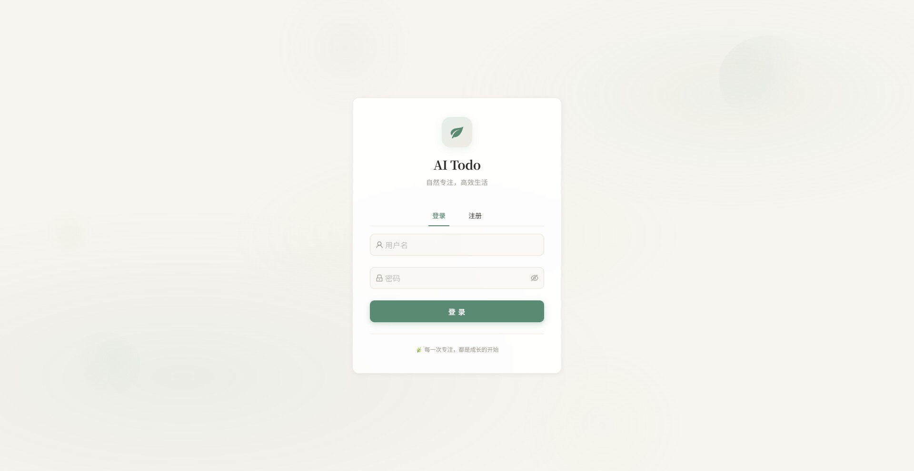
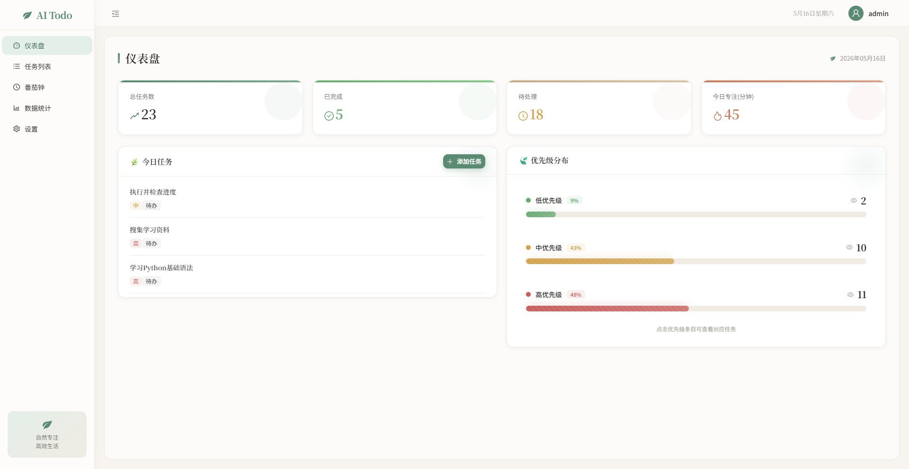
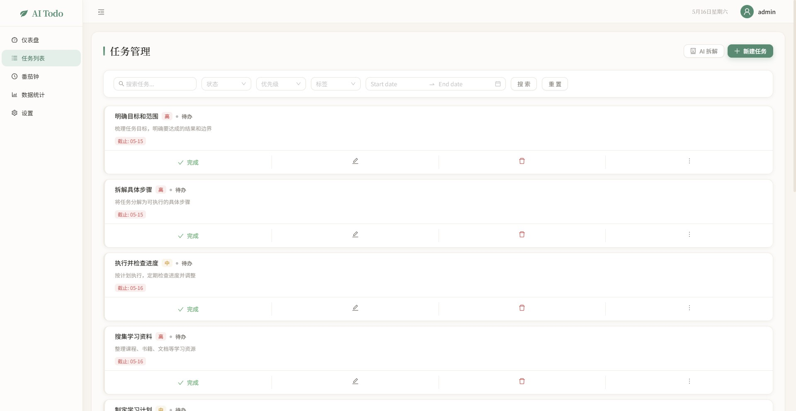
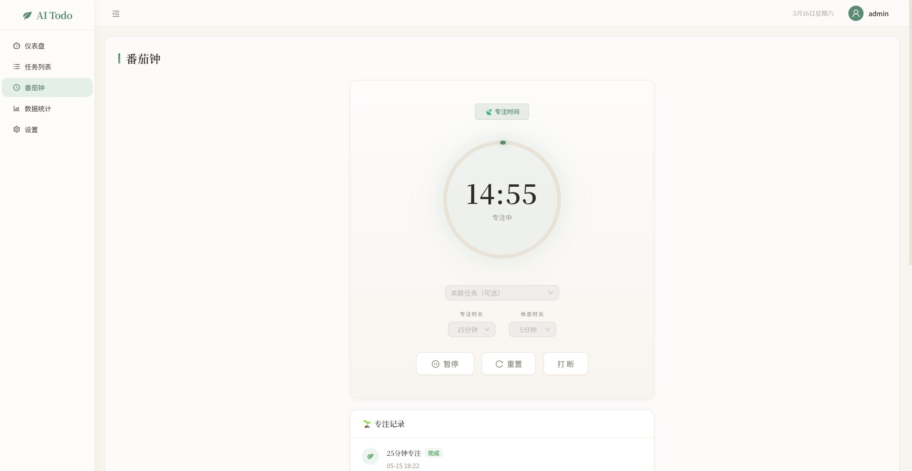
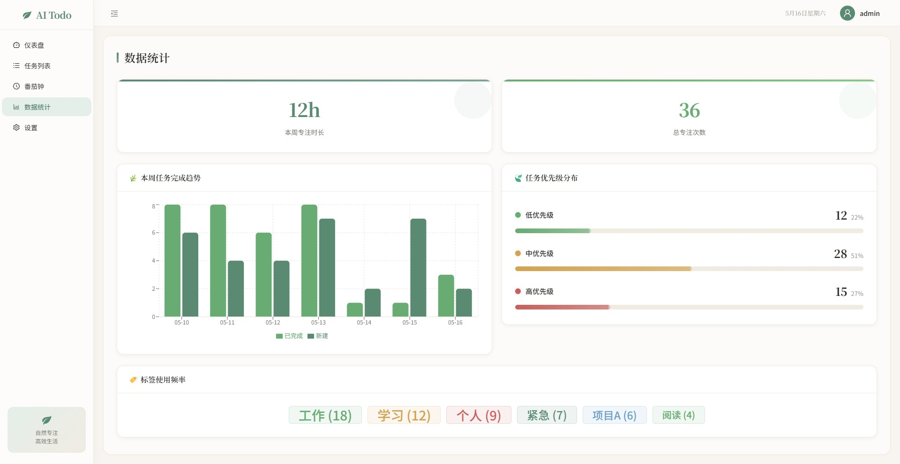
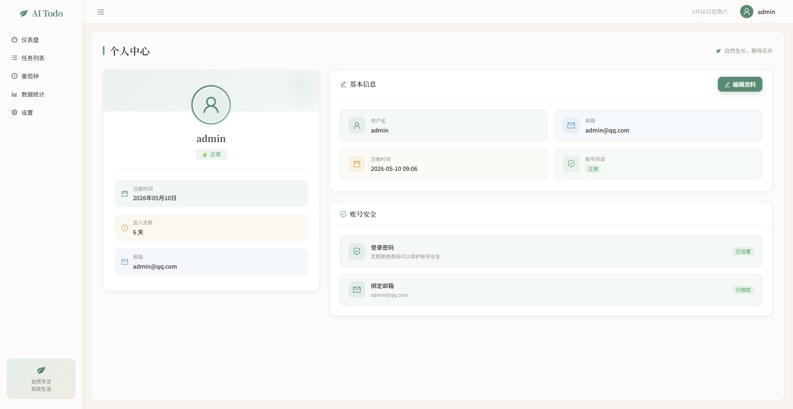
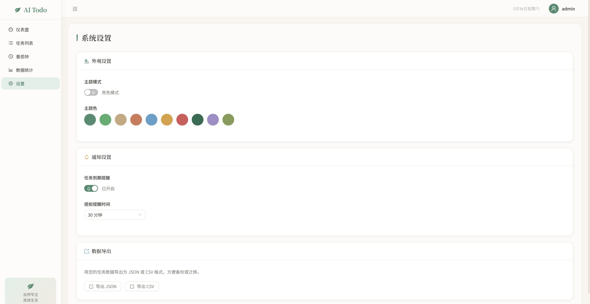

# 🌿 AI Todo - 智能待办清单

一款融合 AI 智能拆解、番茄钟专注、数据可视化的全栈待办清单应用，采用自然风格设计体系。

##  功能亮点

###  任务管理
- 任务 CRUD：标题、描述、优先级（高/中/低）、截止日期、标签、子任务
- 四态流转：待办 → 进行中 → 已完成 → 已归档，支持重新打开
- 多维筛选：按状态、优先级、标签、日期范围筛选，关键词搜索
- 批量操作：多选后批量完成、批量删除
- 分页展示：支持自定义每页条数，快速跳转页码

###  AI 智能拆解
- 输入复杂任务描述（如"准备 Java 面试"），AI 自动生成子任务建议
- 勾选部分建议，一键批量创建子任务
- 降级方案：AI 服务不可用时返回关键词匹配模板

###  番茄钟专注
- SVG 圆形进度环，支持 15/25/45/60 分钟专注 + 5/10/15 分钟休息
- 专注前可绑定任务关联
- 完整控制：开始 / 暂停 / 继续 / 重置 / 打断
- 专注记录列表，区分完成与打断状态

###  数据可视化
- **仪表盘**：统计卡片 + 今日任务（可一键从任务列表选择）+ 优先级分布（点击查看对应任务）
- **统计页**：本周专注时长、任务完成趋势柱状图、优先级分布、标签使用频率

###  主题系统
- 亮色 / 暗色模式即时切换
- 10 种预设主题色（拂晓蓝 / 极客蓝 / 酱紫 / 洋红 / 赤红 / 日暮橙 / 金盏黄 / 极光绿 / 青碧 / 深湖蓝）
- 通知提醒 + 数据导出（JSON / CSV）

###  个人中心
- 卡片式信息展示，内联编辑用户名和邮箱

##  技术栈

| 层级 | 技术 |
|------|------|
| 前端 | React 19 + TypeScript 6 + Vite 8 + Ant Design 6 + Tailwind CSS 4 |
| 状态管理 | Zustand 5 |
| 图表 | Recharts 3 |
| 后端 | Spring Boot 3.2 + Java 17 + MyBatis-Plus 3.5 |
| 安全 | Spring Security + JWT 双 Token（RSA 签名） |
| 数据库 | MySQL 8 + Redis 7 |
| 部署 | Docker Compose（MySQL + Redis + Spring Boot + Nginx） |

##  项目结构

```
ai-todo/
├── assets/
│   └── screenshots/          # 项目截图
├── ai-todo-frontend/          # 前端项目
│   ├── src/
│   │   ├── pages/             # 页面组件
│   │   │   ├── Dashboard.tsx  # 仪表盘
│   │   │   ├── Tasks.tsx      # 任务管理
│   │   │   ├── Pomodoro.tsx   # 番茄钟
│   │   │   ├── Statistics.tsx # 数据统计
│   │   │   ├── Settings.tsx   # 系统设置
│   │   │   ├── Profile.tsx    # 个人中心
│   │   │   └── Login.tsx      # 登录注册
│   │   ├── components/        # 公共组件
│   │   ├── store/             # Zustand 状态管理
│   │   ├── utils/             # 工具函数（Axios 封装等）
│   │   └── index.css          # 全局样式与主题变量
│   ├── Dockerfile
│   └── nginx.conf
│
├── ai-todo-backend/           # 后端项目
│   ├── src/main/java/com/aitodo/
│   │   ├── controller/        # REST API 控制器
│   │   ├── service/           # 业务逻辑层
│   │   ├── mapper/            # MyBatis-Plus 数据访问
│   │   ├── entity/            # 实体类
│   │   ├── dto/               # 数据传输对象
│   │   ├── security/          # JWT 认证与过滤器
│   │   ├── config/            # 配置类
│   │   └── schedule/          # 定时任务
│   ├── src/main/resources/
│   │   ├── db/                # 数据库初始化脚本
│   │   └── application.yml
│   └── Dockerfile
│
├── docker-compose.yml         # 一键部署编排
└── README.md
```

##  快速开始

### 环境要求

- Node.js 18+
- Java 17+
- MySQL 8.0+
- Redis 7+
- Maven 3.8+

### 方式一：Docker Compose 一键启动（推荐）

```bash
git clone https://github.com/Fixedster/ai-todo.git
cd ai-todo
docker-compose up -d
```

启动后访问：
- 前端：http://localhost
- 后端 API：http://localhost:8080

### 方式二：本地开发

#### 1. 启动后端

```bash
cd ai-todo-backend

# 配置 MySQL 和 Redis 连接
# 编辑 src/main/resources/application.yml

# 初始化数据库
# 执行 src/main/resources/db/schema.sql

# 启动
mvn spring-boot:run
```

#### 2. 启动前端

```bash
cd ai-todo-frontend

# 安装依赖
npm install

# 启动开发服务器
npm run dev
```

访问 http://localhost:5173

##  认证机制

- **双 Token 机制**：Access Token（2h）+ Refresh Token（7d）
- **自动续期**：Axios 拦截器检测 401，自动用 Refresh Token 换取新 Access Token
- **并发安全**：多请求同时 401 时排队等待刷新完成
- **服务端登出**：Redis 存储 Token 黑名单，支持强制失效

##  技术亮点

| 亮点 | 说明 |
|------|------|
| JWT 双 Token + Redis 黑名单 | 解决单 Token 续期痛点，支持服务端强制登出 |
| MySQL 全文搜索 + 复合索引 | ngram 全文索引搜索标题描述，筛选走覆盖索引 |
| Redis 缓存策略 | 统计接口缓存 5 分钟 + 写入失效，Token 黑名单自动过期 |
| AI 降级设计 | AI 异常时返回关键词匹配模板，保证核心功能可用 |
| 动态主题系统 | 自定义事件 + ConfigProvider 即时切换，10 种预设主题色 |
| 进度条动画体系 | shimmer 扫光 + barIn 入场 + 光晕底层，纯 CSS 实现 |
| 数据降级方案 | 后端无数据时自动填充 Mock 数据，保证页面完整展示 |
| Docker Compose 全栈部署 | 一键启动，数据卷持久化 |

##  API 概览

| 模块 | 方法 | 路径 | 说明 |
|------|------|------|------|
| 认证 | POST | /api/auth/register | 注册 |
| 认证 | POST | /api/auth/login | 登录（返回双 Token） |
| 认证 | POST | /api/auth/refresh | 刷新 Token |
| 认证 | POST | /api/auth/logout | 登出（加入黑名单） |
| 用户 | GET | /api/user/me | 获取当前用户 |
| 用户 | PUT | /api/user/update | 更新用户信息 |
| 任务 | POST | /api/tasks | 创建任务 |
| 任务 | GET | /api/tasks | 任务列表（分页+筛选） |
| 任务 | PUT | /api/tasks/{id} | 更新任务 |
| 任务 | DELETE | /api/tasks/{id} | 删除任务（软删除） |
| 任务 | POST | /api/tasks/batch | 批量操作 |
| AI | POST | /api/ai/decompose | AI 任务拆解 |
| 番茄钟 | POST | /api/pomodoro/start | 开始专注 |
| 番茄钟 | POST | /api/pomodoro/{id}/end | 结束专注 |
| 统计 | GET | /api/statistics/overview | 统计数据 |

##  项目截图

### 登录页面


### 仪表盘


### 任务列表


### 番茄钟


### 数据统计


### 个人中心


### 设置页


##  License

MIT
